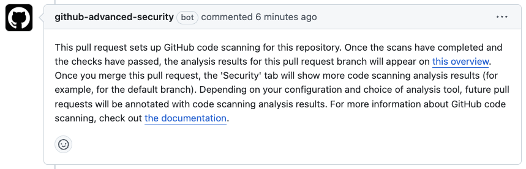
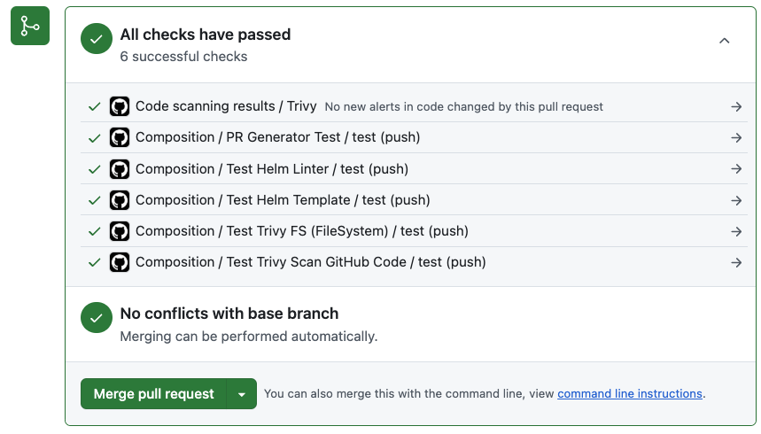
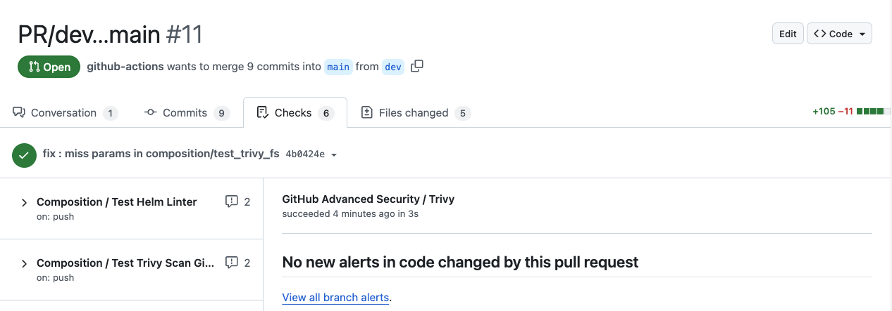

# Test Trivy scan GitHub iac config

[](https://github.com/imantisco/mantisco-github-action/actions/workflows/composition_test_trivy_scan_github_iac_config.yaml)

Trivy로 GitHub IaC Code 스캔하기

- [composition/test_trivy_scan_github_code](../test_trivy_scan_github_code/) : Application Code scan
- [composition/test_trivy_scan_github_iac_code](../test_trivy_scan_github_iac_code/) : IaC Configuration scan

## Get Started

```yaml
name: Composition / Test Trivy Scan GitHub Code

on:
  push:
    branches-ignore:
      - 'main'

jobs:
  test:
    runs-on: ubuntu-22.04
    
    steps:
      - uses: imantisco/mantisco-github-action/composition/test_trivy_scan_github_code@dev
        with:
          format: "sarif"
          severity: "UNKNOWN,LOW,MEDIUM,HIGH,CRITICAL"
          output_file: "trivy-results.sarif"
          hide-progress: false # for Debug mode
```

## More Information

이 GitHub Composite Action을 활성화하면 자동으로 <br>
`Bot(github-advanced-security)`가 코멘트를 남깁니다.



실습 예제인 [Get Started](./README.md#get-started)을 `.github/workflows/*.yaml` 파일로 추가하면 <br>
`All checks have passed` 탭에 `Code scanning results / Trivy`가 추가됩니다.



해당 워크플로가 완료되면 `GitHub Advanced Security / Trivy`가 추가됩니다. <br>
최종적으로 GitHub 저장소의 Security 탭에 그 결과가 기록됩니다.


